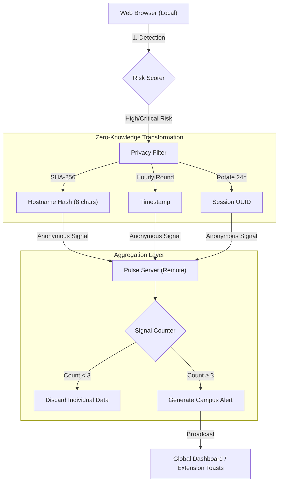

# 🔒 Privacy Architecture — Student Cyber Guardian

This document outlines the **Privacy by Design** principles that protect student identity while enabling campus-wide threat intelligence.

---

## 1. High-Level Data Flow



---

## 2. What Stays vs. What Goes

| Data Type | Treatment | Why? |
| :--- | :--- | :--- |
| **Personally Identifiable Information (PII)** | ❌ **Never Leaves Device** | Identity is irrelevant to threat detection. |
| **Browsing History / Full URL** | ❌ **Never Leaves Device** | We only care about the *threat*, not the specific page path. |
| **IP Address** | ❌ **Stripped at API Edge** | Prevents geolocation or network-based tracking. |
| **Hostname** | 🛡️ **Hashed (SHA-256)** | We only keep the first 8 hex characters. Irreversible. |
| **Timestamp** | 🛡️ **Rounded (Hourly)** | Prevents "timing attacks" to link signals to activity. |
| **User ID** | 🛡️ **Rotating Session UUID** | Rotates every 24 hours. No link to an account. |

---

## 3. The 3-Signal Threshold

To prevent false positives and protect individual privacy, a threat is **never** broadcasted to the campus after a single detection.

1. **Signal 1**: Stored in ephemeral memory.
2. **Signal 2**: Stored in ephemeral memory.
3. **Signal 3**: (From a different session token) → **Escalated**.

Only once 3 independent students confirm the threat does the system alert the entire university.

---

## 4. Technical Implementation (Example)

```json
// Example of a 100% anonymous payload sent to the backend
{
  "campus_id": "mit",
  "threat_category": "phishing",
  "domain_hash": "a1b2c3d4",
  "timestamp": 1708560000000, 
  "session_token": "550e8400-e29b-41d4-a716-446655440000"
}
```
